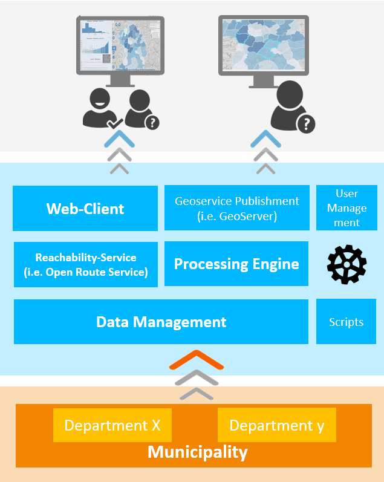

# KomMonitor Web Client

This project is part of the [KomMonitor](http://kommonitor.de) spatial data infrastructure. As web client it acts as the main platform to display and analyze indicator and other georesource data of municipal interest, combine cartographic and statistical visualizations and offer exploration tools to gain insight within the scope of city planning.

**Table of Content**

<!-- TOC depthFrom:1 depthTo:6 withLinks:1 updateOnSave:0 orderedList:0 -->

- [KomMonitor Web Client](#kommonitor-web-client)
	- [Background Information Concerning KomMonitor Spatial Data Infrastructure](#background-information-concerning-kommonitor-spatial-data-infrastructure)
		- [Architecture Overview](#architecture-overview)
	- [Overview](#overview)
	- [Features](#features)
	- [Installation / Building Information](#installation-building-information)
		- [Configuration](#configuration)
			- [env.js - Configure Deployment Details of other Services and App Properties](#envjs-configure-deployment-details-of-other-services-and-app-properties)
		- [Running the NodeJS KomMonitor Web Client](#running-the-nodejs-kommonitor-web-client)
			- [Local Manual Startup and Shutdown](#local-manual-startup-and-shutdown)
			- [Production Startup and Shutdown](#production-startup-and-shutdown)
		- [Docker](#docker)
	- [User Guide](#user-guide)
	- [Contribution - Developer Information](#contribution-developer-information)
		- [How to Contribute](#how-to-contribute)
		- [Hints on how to integrate a new Module](#hints-on-how-to-integrate-a-new-module)
		- [Branching](#branching)
	- [Third Party Dependencies](#third-party-dependencies)
	- [Contact](#contact)
	- [Credits and Contributing Organizations](#credits-and-contributing-organizations)

<!-- /TOC -->

## Background Information Concerning KomMonitor Spatial Data Infrastructure
This software is part of a spatial data infrastructure called [KomMonitor](http://kommonitor.de), which is a shortcut for German "Kommunales Monitoring" (Municipal monitoring). Funded by the *German Federal Ministry of Education and Research* municipal actors from the cities Essen and Mülheim cooperate with scientists from the Ruhr University Bochum and the Bochum University of Applied Sciences in order to create a monitoring infrastructure to support planning processes within local governments. I.e., by monitoring certain planning aspects from various topics like demography, social, environment, habitation and other, whose spatio-temporal variation and development can be measured in the form of indicators, [KomMonitor](http://kommonitor.de) may act as a *Spatial Decision Support System*. Amongst others, the following goals and key aspects are focused:
1. cross-sectional data from several topics
2. variable spatial layers (i.e. administrative layers of a city)
3. transparency with regard to indicators and how they are computed
4. cross-sectional interactive analysis and exploration
5. a complete spatial data infrastructure consisting of data management, geodata processing and indicator computation as well as data display and exploration in webclient

The project is funded from Feb 2017 - Feb 2020. The resulting software components, are published as Open-Source software to continue maintenance and development beyond the funding period.

### Architecture Overview


As a spatial decision support system, the main idea behind KomMonitor is to take (geo-)data from local authorities, import them to the *Data Management* component, process them (i.e. compute indicators based on georesurces and maybe other indicators via the *Processing Engine*; or compute waypath routing and reachability isochrones via *Reachability Service*) and finally publish, display and analyze them within a *Web-Client*.     

## Overview
This **Web client** is specially designed to consume the remaining components of the **KomMonitor spatial data infrastructure**, i.e. the [Data Management API](https://gitlab.fbg-hsbo.de/kommonitor/kommonitor-data-management-api) and [Processing Engine](https://gitlab.fbg-hsbo.de/kommonitor/kommonitor-script-execution-api) as well as **Reachability Service - e.g. Open Route Service** and **GeoServer**. With the scope of a spatial decision support system, it consumes the relevant municipal geospatial and statistical data for systematical display, exploration and analyzation. As described in section [Features](#features) dedicated tools are developed to support city planners and other employees of local authorities in their daily work.

The Web client is based on Angular and Bootstrap and hence uses a modular project structure for the implementation of the dedicated tools (i.e. map module for cartographic display; charting tools for bar, line or radar charts; etc...).

## Features

The following non-exclusive list of features presents key features of the **KomMonitor Web Client**. Note that it is still under development, so some mentioned features are currently not implemented and the list might be extended in the future.

**<u>Key Features</u>**:

 - linked combination of cartographic and statistical display of indicators (i.e. hover over map features to highlight corresponding diagram elements and vice versa)
 - typical map interactions (pan, zoom, measure, search, etc.)
 - multiple diagrams to support indicator analysis
    - histogram chart for value distribution
    - bar chart for feature comparison
    - line chart for indicator time series display
    - radar chart for indicator comparison (create a "profile" for certain features)
    - scatter chart comparing all features of two indicators
    - maybe more in the future...
 - adjustable classification options for indicator display
 - add POIs (Points of Interest), LOIs (Lines of Interest), AOIs (Areas of Interest) to map
 - various filter techniques (spatial, attributive, value range, etc.)
 - balance computation regarding time series of indicators
 - reachability analysis
    - routing
    - distance and time isochrones
 - customizable indicator computation with individually set process parameters (i.e. change relevant radius of reachability indicator and compare result to "default" indicator)
 - export data
    - metadata
    - spatial data
    - statistical diagrams as image or get the actual values as data table.
 - ...       

## Installation / Building Information
Currently a combination of `npm`, `webpack` and `grunt` is used to build the Angular-based application.

`NOTE: THIS SHOULD BE CHANGED IN THE FUTURE TO ONLY USE ONE BUILD TOOL.`

In short, after downloading the project you should run the following command in that order from project root:

1. `npm install` to fetch all required node modules.
2. `webpack` or `npx webpack` (depending on you system environment) to copy used libraries into `./app/dependencies`, from where they will be linked in `./app/index.html`
3. `grunt` to bundle and minify app script code and create a ready-to-deploy `./dist`, which you can simply copy into any application server like Tomcat.
4. (optional) `grunt buildWar` to perform the same as in step 3. but in addition create a `./build/kommonitor-webclient.WAR` WAR file for deployment in a web application server.

Even Docker images can be acquired with ease, as described below. However, depending on your environment configuration aspects have to be adjusted first.

### Configuration
Similar to other **KomMonitor** components, some settings are required, especially to adjust connection details to other linked services to your local environment. The configuration is done in a file called `env.js` located at project root. When starting the app the key-value pairs are made available globally to populate them to app components.

#### env.js - Configure Deployment Details of other Services and App Properties
The central configuration file is located at [app/env.js](./app/env.js). Several important aspects must match your target environment when deploying the app. These are:

- connection to KomMonitor Data Management API:
```javascript
// Data Management API URL
window.__env.apiUrl = 'http://localhost:8085/';
// Base url for Data Management API
window.__env.basePath = 'management';
// optional geometry simplification (a feature of Data Management API)
window.__env.simplifyGeometriesParameterName = "simplifyGeometries";
// allowed values and meaning:
// ["original" --> no simplification; "weak" --> weak simplification,
// "medium" --> medium simplification; "strong" --> string simplification]
window.__env.simplifyGeometriesOptions = [{"label": "nein", "value": "original"}, {"label": "schwach", "value": "weak"}, {"label": "mittel", "value": "medium"}, {"label": "stark", "value": "strong"}];
// use strong as default to minimize size of queried features
// for display, strong simplification is okay
window.__env.simplifyGeometries = "strong";
```
- connection to Open Route Service instance:
```javascript
// Open Route Service URL
window.__env.targetUrlToReachabilityService_ORS = 'http://localhost:8090/openrouteservice-4.7.2';
```
- required property names of ID and NAME property of KomMonitor features as well as timeseries specific prefixes (**<u>MUST NOT BE CHANGED</u>**) :
```javascript
// property names of feature id and name (relevant for all spatial features) - KomMonitor specific
// DO NOT CHANGE THEM - ONLY IF YOU REALLY KNOW WHAT YOU ARE DOING
window.__env.FEATURE_ID_PROPERTY_NAME = "ID";
window.__env.FEATURE_NAME_PROPERTY_NAME = "NAME";
window.__env.indicatorDatePrefix = "DATE_";
```
- initial startup configuration:
```javascript
// number of decimals for display of numeric values in app
window.__env.numberOfDecimals = 2;
// starting viewpoint parameters and zoom level
window.__env.initialLatitude = 51.4386432;
window.__env.initialLongitude = 7.0115552;
window.__env.initialZoomLevel = 12;
window.__env.minZoomLevel = 11;
window.__env.maxZoomLevel = 22;
// starting indicator and spatial unit
// if faulty values are provided, a random indicator will be displayed
window.__env.initialIndicatorId = "d6f447c1-5432-4405-9041-7d5b05fd9ece";
window.__env.initialSpatialUnitName = "Stadtteilebene";
```
- various color and classification settings:
```javascript
// various color settings
 window.__env.defaultColorForNoDataValues = "black";
 window.__env.defaultBorderColorForNoDataValues = "black";
 window.__env.defaultColorForOutliers_high = "#191919";
 window.__env.defaultBorderColorForOutliers_high = "black";
 window.__env.defaultFillOpacityForOutliers_high = "0.7";
 window.__env.defaultColorForOutliers_low = "#4f4f4f";
 window.__env.defaultBorderColorForOutliers_low = "black";
 window.__env.defaultFillOpacityForOutliers_low = "0.7";
 window.__env.defaultColorForHoveredFeatures = "#e01414";
 window.__env.defaultColorForClickedFeatures = "#42e5f4";
 window.__env.defaultColorForZeroValues = "#bababa";
 window.__env.defaultBorderColor = "black";
 window.__env.defaultColorForFilteredValues = "rgba(255,255,255,0)";
 window.__env.defaultBorderColorForFilteredValues = "black";
 window.__env.defaultFillOpacity = "0.7";
 window.__env.defaultFillOpacityForFilteredFeatures = "0.7";
 window.__env.defaultFillOpacityForZeroFeatures = "0.7";
 window.__env.defaultFillOpacityForNoDataFeatures = "0.7";
 window.__env.defaultFillOpacityForHighlightedFeatures = "0.8";
 window.__env.useTransparencyOnIndicator = true;
 window.__env.useOutlierDetectionOnIndicator = false;
 // default color for specific classification as ColorBrewer palette name
 // i.e. balance mode
 // i.e. measure of value classification (German: Schwellwertklassifizierung)
 window.__env.defaultColorBrewerPaletteForBalanceIncreasingValues = "Purples";
 window.__env.defaultColorBrewerPaletteForBalanceDecreasingValues = "YlOrBr";
 window.__env.defaultColorBrewerPaletteForGtMovValues = "YlOrBr";
 window.__env.defaultColorBrewerPaletteForLtMovValues = "Blues";
 // classification
 //allowesValues: equal_interval, quantile, jenks
 window.__env.defaultClassifyMethod = "equal_interval";
```
- recipient mail address for feedback-form:
```javascript
// e-mail recipient for feedback mail
window.__env.feedbackMailRecipient = "name@mail.example";
```

After adjusting the configuration to your target environment, you may continue to build and run the service as described below.

### Running the NodeJS KomMonitor Web Client

#### Local Manual Startup and Shutdown
In a local setup (i.e. for test purposes), you only must ensure that all dependencies are installed and put where expected. Hence, only the two first installation steps from above must be run:

1. `npm install` to fetch all required node modules.
2. `webpack` or `npx webpack` (depending on you system environment) to copy used libraries into `./app/dependencies`, from where they will be linked in `./app/index.html`

To locally start the app, simply navigate to project root and execute `npm start`, which will host the app at `localhost:8000` (<u>of course you must ensure, that the associated remaining KomMonitor components - Data Management API, Processing Engine, Open Route Service and optional GeoServer - are setup and started also</u>).
In this test environment, changes to the underlying sources are automatically reflected to the running test instance. So any tests or modifications can be tested locally before building the app for production. To shutdown simply hit `CTRL+c` in the terminal.

#### Production Startup and Shutdown

As described above the following steps must be executed to build the project completely:

1. `npm install` to fetch all required node modules.
2. `webpack` or `npx webpack` (depending on you system environment) to copy used libraries into `./app/dependencies`, from where they will be linked in `./app/index.html`
3. `grunt` to bundle and minify app script code and create a ready-to-deploy `./dist`, which you can simply copy into any application server like Tomcat.
4. (optional) `grunt buildWar` to perform the same as in step 3. but in addition create a `./build/kommonitor-webclient.WAR` WAR file for deployment in a web application server.

Either the `dist` folder with all its contents or the `build/kommonitor-webclient.WAR` file can then be deployed using a standard web application server like Tomcat.
Assuming the WAR file is named `kommonitor-webclient.WAR` and Tomcat is started locally on port 8080, you may reach the web app via `localhost:8080/kommonitor-webclient`.

### Docker
The **KomMonitor Web Client** can also be build and deployed as Docker image (i.e. `docker build -t kommonitor-web-client:latest .`). The project contains the associated `Dockerfile` and an exemplar `docker-compose.yml` on project root level. The Dockerfile relies on an existing `dist` folder, so you must build the project before according to the building steps listed above. Only then the docker image can be created.

The exemplar [docker-compose.yml](./docker-compose.yml) file specifies only the `kommonitor-web-client` service as all required connections to the respective components of KomMonitor are configured in `./app/env.js` (connection details to other services etc. according to the [Configuration section](#configuration) mentioned above).

## User Guide
The User Guide is written in a separate [ReadMe](./documentation/README.md).

## Contribution - Developer Information
This section contains information for developers.

### How to Contribute
The technical lead of the whole [KomMonitor](http://kommonitor.de) spatial data infrastructure currently lies at the Bochum University of Applied Sciences, Department of Geodesy. We invite you to participate in the project and in the software development process. If you are interested, please contact any of the persons listed in the [Contact section](#contact)

### Hints on how to integrate a new Module
TODO

Things to mention:
- hierarchical code structure
   - put new module where it is integrated within the application
- how to write module, controller and template
- how to take care of dependency injection (inject angular-internal modules as well as other depending app modules in new module; inject new module in HTML and module of superior module where it shall be placed)   
- add new codefiles to build tools etc. (beware of order of integration with regard to what module depends on what other module etc.)
- how to add new libraries and integrate them to build tools
- ...

`MAYBE AS SEPARATE DOCUMENTATION TO KEEP THIS README SHORT`

### Branching
The `master` branch contains latest stable releases. The `develop` branch is the main development branch that will be merged into the `master` branch from time to time. Any other branch focuses certain bug fixes or feature requests.

## Third Party Dependencies
We use [license-checker](https://www.npmjs.com/package/license-checker) to gain insight about used third party libs. I.e. install globally via ```npm install -g license-checker```, navigate to root of the project and then perform ```license-checker --json --out ThirdParty.json``` to create/overwrite the respective file in JSON format.

## Contact

|    Name   |   Organization    |    Mail    |
| ------------- |-------------| -----|
| Christian Danowski-Buhren | Bochum University of Applied Sciences | christian.danowski-buhren@hs-bochum.de |
| Andreas Wytzisk  | Bochum University of Applied Sciences | Andreas-Wytzisk@hs-bochum.de |
| Ulrike Klein | Bochum University of Applied Sciences | christian.danowski-buhren@hs-bochum.de | Ulrike.Klein@hs-bochum.de |

## Credits and Contributing Organizations
- Department of Geodesy, Bochum University of Applied Sciences
- Department for Cadastre and Geoinformation, Essen
- Department for Geodata Management, Surveying, Cadastre and Housing Promotion, Mülheim an der Ruhr
- Department of Geography, Ruhr University of Bochum
