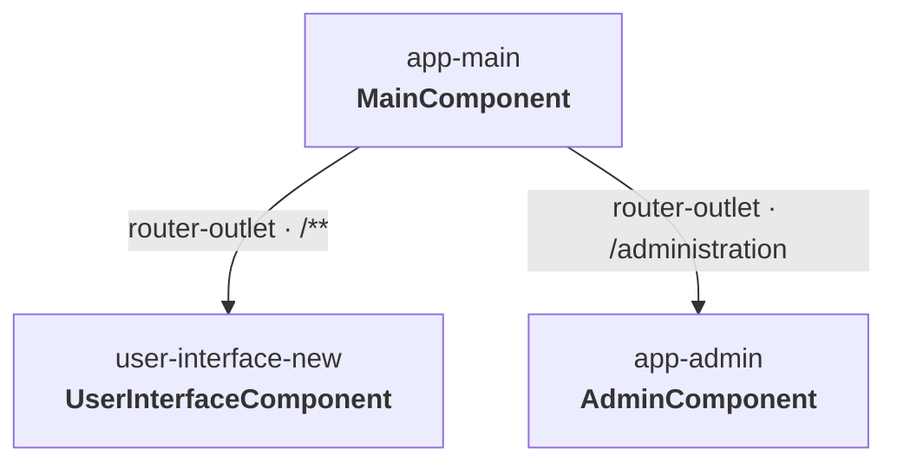

# Komponenten-Verschachtelungsbaum

Stand: 2026-08-27.

Dieses Dokument zeigt, wie die **Hauptkomponenten** der KomMonitor Web-App ineinander
verschachtelt sind. Die Verschachtelung ergibt sich aus den Selektoren, die in den
jeweiligen Component-Templates verwendet werden.

Die Wurzel ist `MainComponent` (`app/mainComponent/main/`), die nur ein
`<router-outlet>` enthält. Über das Routing (`app/app.routes.ts`) verzweigt die App in
zwei Hauptbereiche:

- **UserInterface** (`/**`) — Karte, Diagramme, Sidebar, Legende
- **Administration** (`/administration`, geschützt durch `authAdminGuard`)

## Wurzel & Routing

Beide Bereiche hängen an derselben Wurzel `MainComponent`, die über das
`router-outlet` je nach Route den UserInterface- oder den Admin-Baum lädt.

## Diagramm 1 — UserInterface

```mermaid
flowchart TB
    UI["user-interface-new<br/><b>UserInterfaceComponent</b>"]

    UI --> UILogin["app-user-login<br/>UserLoginComponent"]
    UI --> Sidebar["app-sidebar<br/>SidebarComponent"]
    UI --> MapArea
    UI --> ExportBtn["app-export-menu-button<br/>ExportMenuButtonComponent"]
    UI --> Legend["app-kommonitor-legend<br/>KommonitorLegendComponent"]

    subgraph Panels["Sidebar-Panels (konditionell, *ngIf)"]
        direction TB
        DataSetup["app-kommonitor-data-setup<br/>KommonitorDataSetupComponent"]
        Poi["app-poi<br/>PoiComponent"]
        DataImport["app-kommonitor-data-import<br/>KommonitorDataImportComponent"]
        Filter["app-kommonitor-filter<br/>KommonitorFilterComponent"]
        Balance["app-kommonitor-balance<br/>KommonitorBalanceComponent"]
        Diagrams["app-kommonitor-diagrams<br/>KommonitorDiagramsComponent"]
        Radar["app-indicator-radar<br/>IndicatorRadarComponent"]
        Regression["app-regression-diagram<br/>RegressionDiagramComponent"]
        Reachability["app-kommonitor-reachability<br/>KommonitorReachabilityComponent"]
    end
    Sidebar --> Panels
    Filter --> FilterBox["expandable-box<br/>ExpandableBoxComponent"]

    subgraph MapArea["Karten-Container"]
        direction TB
        Slider["custom-slider<br/>CustomSliderComponent"]
        Map["app-kommonitor-map<br/>KommonitorMapComponent"]
    end

    %% Legende + Klassifizierung
    Legend --> LegendBox["expandable-box<br/>ExpandableBoxComponent"]
    Legend --> Classification["kommonitor-classification-component<br/>KommonitorClassificationComponent"]
    Classification --> MethodSelect["app-classification-method-select<br/>ClassificationMethodSelectComponent"]
    Classification --> ClassBox["expandable-box<br/>ExpandableBoxComponent"]
```

## Diagramm 2 — Administration

```mermaid
flowchart TB
    Admin["app-admin<br/><b>AdminComponent</b>"]

    subgraph AdminChrome["Kopf-/Fußbereich"]
        direction TB
        SessionValidity["app-session-validity<br/>SessionValidityComponent"]
        AdminLogin["app-user-login<br/>UserLoginComponent"]
        Notification["app-notification<br/>NotificationComponent"]
    end
    Admin --> AdminChrome

    subgraph AdminDash["Dashboard"]
        direction TB
        Dashboard["app-admin-dashboard-management<br/>AdminDashboardManagementComponent"]
        Dashboard --> ContentView["app-admin-content-view<br/>AdminContentViewComponent"]
        Dashboard --> SmallBox["app-small-box<br/>SmallBoxComponent"]
    end
    Admin --> AdminDash

    subgraph AdminGeo["Geodaten-Verwaltung"]
        direction TB
        Topics["app-admin-topics-management<br/>AdminTopicsManagementComponent"]
        SpatialUnits["app-admin-spatial-units-management<br/>AdminSpatialUnitsManagementComponent"]
        Indicators["app-admin-indicators-management<br/>AdminIndicatorsManagementComponent"]
        Georesources["app-admin-georesources-management<br/>AdminGeoresourcesManagementComponent"]
    end
    Admin --> AdminGeo

    subgraph AdminScripts["Skripte"]
        direction TB
        ScriptMgmt["app-admin-script-management<br/>AdminScriptManagementComponent"]
        ScriptExec["app-admin-script-execution<br/>AdminScriptExecutionComponent"]
    end
    Admin --> AdminScripts

    subgraph AdminRoles["Rollen"]
        direction TB
        RoleMgmt["app-admin-role-management<br/>AdminRoleManagementComponent"]
        RoleExpl["app-admin-role-explanation<br/>AdminRoleExplanationComponent"]
    end
    Admin --> AdminRoles

    subgraph AdminConfig["Konfiguration"]
        direction TB
        AppConfig["app-admin-app-config<br/>AdminAppConfigComponent"]
        ControlsConfig["app-admin-controls-config<br/>AdminControlsConfigComponent"]
        FilterConfig["app-admin-filter-config<br/>AdminFilterConfigComponent"]
    end
    Admin --> AdminConfig
```

## Hinweise zur Struktur

- **Zwei Hauptzweige über Routing:** `MainComponent` hält nur `<router-outlet>`. Die
  Aufteilung in _UserInterface_ (`/**`) und _Administration_ (`/administration`)
  geschieht in `app/app.routes.ts` — keine direkte Selektor-Verschachtelung.
- **Sidebar-Panels sind alternativ** (`*ngIf` über `visibilityHelperService`), nicht
  gleichzeitig sichtbar. Jeder Sidebar-Button schaltet genau ein Panel frei.
- **Wiederverwendete Bausteine** über beide Bereiche: `expandable-box`, `app-user-login`.
  `app-admin-content-view` dient als Layout-Wrapper für Admin-Seiten.
- **Modals fehlen im Baum**, weil sie nicht über Selektoren eingebettet, sondern
  programmatisch geöffnet werden (z. B. `openInfoModal()`, `openReportingModal()` in
  `UserInterfaceComponent`).
- **Blattkomponenten** ohne eigene Unterkomponenten sind v. a. `app-kommonitor-map`
  (reine Leaflet-Orchestrierung) und `custom-slider`.
- **Geteilte Admin-Bausteine** unter `admin/adminShared/` (`app-resource-metadata-form`,
  `app-role-management-grid`, `app-owner-organization-select`) und
  `admin/adminConfig/configEditor/` (`app-config-editor-panes`) tauchen in den Diagrammen
  nicht auf: sie werden überwiegend **innerhalb der Modals** eingebettet, und Modals sind
  aus dem Baum ausgenommen (siehe oben).

## Selektor → Komponente → Pfad

| Selektor                              | Klasse                               | Pfad (unter `app/`)                                                     |
| ------------------------------------- | ------------------------------------ | ----------------------------------------------------------------------- |
| `app-main`                            | MainComponent                        | `mainComponent/main/`                                                   |
| `user-interface-new`                  | UserInterfaceComponent               | `components/ngComponents/userInterface/`                                |
| `app-admin`                           | AdminComponent                       | `components/ngComponents/admin/`                                        |
| `app-sidebar`                         | SidebarComponent                     | `components/ngComponents/userInterface/sidebar/`                        |
| `app-kommonitor-map`                  | KommonitorMapComponent               | `components/ngComponents/userInterface/kommonitorMap/`                  |
| `app-kommonitor-legend`               | KommonitorLegendComponent            | `components/ngComponents/userInterface/kommonitorLegend/`               |
| `kommonitor-classification-component` | KommonitorClassificationComponent    | `components/ngComponents/userInterface/kommonitorClassification/`       |
| `app-classification-method-select`    | ClassificationMethodSelectComponent  | `components/ngComponents/common/classificationMethodSelect/`            |
| `expandable-box`                      | ExpandableBoxComponent               | `components/ngComponents/common/expandable-box/`                        |
| `custom-slider`                       | CustomSliderComponent                | `components/ngComponents/common/custom-slider/`                         |
| `app-user-login`                      | UserLoginComponent                   | `components/ngComponents/common/userLogin/`                             |
| `app-export-menu-button`              | ExportMenuButtonComponent            | `components/ngComponents/userInterface/exporting/export-menu-button/`   |
| `app-kommonitor-data-setup`           | KommonitorDataSetupComponent         | `components/ngComponents/userInterface/sidebar/kommonitorDataSetup/`    |
| `app-poi`                             | PoiComponent                         | `components/ngComponents/userInterface/sidebar/poi/`                    |
| `app-kommonitor-data-import`          | KommonitorDataImportComponent        | `components/ngComponents/userInterface/sidebar/kommonitorDataImport/`   |
| `app-kommonitor-filter`               | KommonitorFilterComponent            | `components/ngComponents/userInterface/sidebar/kommonitorFilter/`       |
| `app-kommonitor-balance`              | KommonitorBalanceComponent           | `components/ngComponents/userInterface/sidebar/kommonitorBalance/`      |
| `app-kommonitor-diagrams`             | KommonitorDiagramsComponent          | `components/ngComponents/userInterface/sidebar/kommonitorDiagrams/`     |
| `app-indicator-radar`                 | IndicatorRadarComponent              | `components/ngComponents/userInterface/sidebar/indicatorRadar/`         |
| `app-regression-diagram`              | RegressionDiagramComponent           | `components/ngComponents/userInterface/sidebar/regressionDiagram/`      |
| `app-kommonitor-reachability`         | KommonitorReachabilityComponent      | `components/ngComponents/userInterface/sidebar/kommonitorReachability/` |
| `app-admin-dashboard-management`      | AdminDashboardManagementComponent    | `components/ngComponents/admin/adminDashboardManagement/`               |
| `app-admin-content-view`              | AdminContentViewComponent            | `components/ngComponents/admin/admin-content-view/`                     |
| `app-small-box`                       | SmallBoxComponent                    | `components/ngComponents/admin/adminDashboardManagement/small-box/`     |
| `app-admin-role-management`           | AdminRoleManagementComponent         | `components/ngComponents/admin/adminRoleManagement/`                    |
| `app-admin-role-explanation`          | AdminRoleExplanationComponent        | `components/ngComponents/admin/adminRoleExplanation/`                   |
| `app-admin-topics-management`         | AdminTopicsManagementComponent       | `components/ngComponents/admin/adminTopicsManagement/`                  |
| `app-admin-spatial-units-management`  | AdminSpatialUnitsManagementComponent | `components/ngComponents/admin/adminSpatialUnitsManagement/`            |
| `app-admin-indicators-management`     | AdminIndicatorsManagementComponent   | `components/ngComponents/admin/adminIndicatorsManagement/`              |
| `app-admin-georesources-management`   | AdminGeoresourcesManagementComponent | `components/ngComponents/admin/adminGeoresourcesManagement/`            |
| `app-admin-script-management`         | AdminScriptManagementComponent       | `components/ngComponents/admin/adminScriptManagement/`                  |
| `app-admin-script-execution`          | AdminScriptExecutionComponent        | `components/ngComponents/admin/adminScriptExecution/`                   |
| `app-admin-app-config`                | AdminAppConfigComponent              | `components/ngComponents/admin/adminConfig/adminAppConfig/`             |
| `app-admin-controls-config`           | AdminControlsConfigComponent         | `components/ngComponents/admin/adminConfig/adminControlsConfig/`        |
| `app-admin-filter-config`             | AdminFilterConfigComponent           | `components/ngComponents/admin/adminConfig/adminFilterConfig/`          |
| `app-session-validity`                | SessionValidityComponent             | `components/ngComponents/common/userLogin/session-validity/`            |
| `app-notification`                    | NotificationComponent                | `components/ngComponents/common/notification/`                          |
| `app-resource-metadata-form`          | ResourceMetadataFormComponent        | `components/ngComponents/admin/adminShared/resourceMetadataForm/`       |
| `app-role-management-grid`            | RoleManagementGridComponent          | `components/ngComponents/admin/adminShared/roleManagementPanel/`        |
| `app-owner-organization-select`       | OwnerOrganizationSelectComponent     | `components/ngComponents/admin/adminShared/roleManagementPanel/`        |
| `app-config-editor-panes`             | ConfigEditorPanesComponent           | `components/ngComponents/admin/adminConfig/configEditor/`               |
